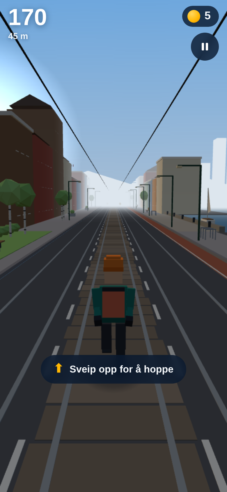

# Oslo Rush

Et mobilførst 3D-løpespill i nettleseren: du er et bybud som raser gjennom et lekent, stilisert Oslo — mellom trikker, veiarbeid og veltede elsparkesykler.

**Oslo Rush** is a mobile-first, browser-based 3D endless runner built with Vite, TypeScript and Three.js. Everything — geometry, textures, audio — is generated procedurally at runtime. No backend, no accounts, no external assets, no network requests after load. Installable as a basic PWA.



## Controls

| Action | Touch | Keyboard |
| --- | --- | --- |
| Change lane | Swipe left / right | ← → or A / D |
| Jump | Swipe up | ↑, W or Space |
| Slide | Swipe down | ↓ or S |
| Start / restart | Tap | Enter |

Score is mainly distance; each Oslo token adds a bonus. The high score is stored locally. The game auto-pauses when the tab loses focus.

## Run it locally

Requires Node 20+.

```bash
npm install
npm run dev
```

Vite prints a local URL (default `http://localhost:5173`) — open it in any desktop browser.

Other commands:

```bash
npm test           # vitest: solver, spawner fairness, scoring, difficulty, reset
npm run typecheck  # tsc --noEmit
npm run build      # typecheck + production build into dist/
npm run preview    # serve the production build
npm run validate   # headless-browser E2E on a 390×844 viewport (build first)
npm run icons      # regenerate PWA icons
```

`validate` and `icons` drive a headless Chromium. They default to the path used in the original dev container; on your own machine point them at any Chromium/Chrome binary:

```bash
CHROMIUM_PATH="$(which chromium || which google-chrome)" npm run validate
```

## Open it on your phone (same network)

1. Start the dev server exposed to your LAN (already the default here):
   ```bash
   npm run dev        # runs vite --host
   ```
2. Vite prints a **Network** URL such as `http://192.168.1.23:5173`.
3. Make sure the phone is on the same Wi-Fi as your computer, then open that URL in Safari (iPhone) or Chrome (Android).
4. For the full-screen PWA experience use the production build instead:
   ```bash
   npm run build && npm run preview   # network URL on port 4173
   ```
   then "Add to Home Screen" / "Install app" from the browser menu.

Portrait is the intended orientation (~390×844), but the game resizes cleanly.

If the phone cannot reach the URL, check that your firewall allows the port, or use `npx vite --host --port 8080` to pick another port.

## Development mode

Append `?debug=1` to the URL (or press **Ctrl+Shift+D**). You get FPS, current speed, seed readout, invincibility (**I**), collision-box overlay (**B**), force-spawn buttons for every obstacle type, high-score reset, and restart-with-the-same-seed (**R**). `?seed=123` makes the first run reproducible.

## How it stays fair

Route generation is validated by a BFS solver (`src/world/solver.ts`) that simulates a stricter-than-human player (coarser action grid, extra cooldown, expanded hitboxes) over every planned window. Patterns that cannot be survived from the player's actual current state are rejected before they spawn, and the running game re-validates twice a second, pruning far-away obstacles if the remaining window ever becomes unwinnable. The test suite plays complete 1.5–3 km runs across dozens of seeds with a solver-driven bot.

## Customizing content

All tuning and content lives in `src/config/content.ts` (plus UI text in `src/config/strings.ts`). Game logic only references content by ID.

### Change the character colors

Edit `CHARACTERS.courier.colors` in `src/config/content.ts` — jacket, beanie, backpack, trousers, skin, boots are all plain hex values. The rig picks them up automatically.

### Replace the character with a GLB model later

1. Put the model under `public/assets/characters/` (folder already reserved).
2. Set `CHARACTERS.courier.glbPath = 'assets/characters/your-model.glb'`.
3. In `src/player/character.ts`, extend `createCharacter()` to load the GLB (e.g. with `GLTFLoader`) when `def.glbPath` is set and wrap it in the same `update(dt, state)` interface the procedural rig implements. The procedural rig remains the fallback when `glbPath` is `null`.

### Add a new obstacle type

1. Add a definition to `OBSTACLES` in `src/config/content.ts` — id, kind (`'block' | 'jump' | 'slide'`), hitbox size, unlock time (`minTime`), spawn `weight`.
2. Add a visual builder case for the id in `createObstacle()` (`src/world/obstacles.ts`).
3. Optionally reference the id in a pattern in `src/world/spawner.ts` — the generic `single`/`double`/`slalom` patterns automatically include any unlocked `jump`-kind obstacle.
The solver and fairness validation pick the new type up from its hitbox definition — nothing else to wire.

### Change obstacle frequency

Adjust `weight` per obstacle in `OBSTACLES`, pattern weights in the `patterns` list in `src/world/spawner.ts`, or global pacing via `DIFFICULTY.gapKeys` (seconds of breathing room between patterns over run time).

### Create a second city theme

1. Add a theme object to `THEMES` in `src/config/content.ts` (palette, fog, sun, building colors…).
2. Point `CONTENT.activeTheme` at it.
3. For different *architecture* (not just colors), add or adjust chunk variants in `src/world/chunks.ts` — `createEnvironmentChunk(theme, variant, rng)` is the factory the streaming system uses.

### Change UI text

Everything user-visible is in `src/config/strings.ts`.

## Project layout

```
src/
  config/     content & tuning (IDs, obstacles, themes, difficulty, strings)
  core/       game orchestrator, loop, camera, input, audio, storage, scoring
  world/      solver, spawner, difficulty curve, chunks, obstacles, tokens, sky
  player/     procedural courier rig + movement controller
  fx/         particles, speed lines
  ui/         HUD, screens, debug panel
tests/        vitest suite (fairness bot, solver, scoring, difficulty, reset)
scripts/      icon generation + headless browser validation
public/       manifest, service worker, icons, reserved asset folders
```

## Known limitations

- Sound is minimal synthesized SFX/ambience (by design — no audio files).
- iOS Safari has no Vibration API, so the vibration toggle is a no-op there.
- The procedural character is intentionally simple; see above for GLB replacement.
- One environment theme (`oslo-summer`) ships in this version.
